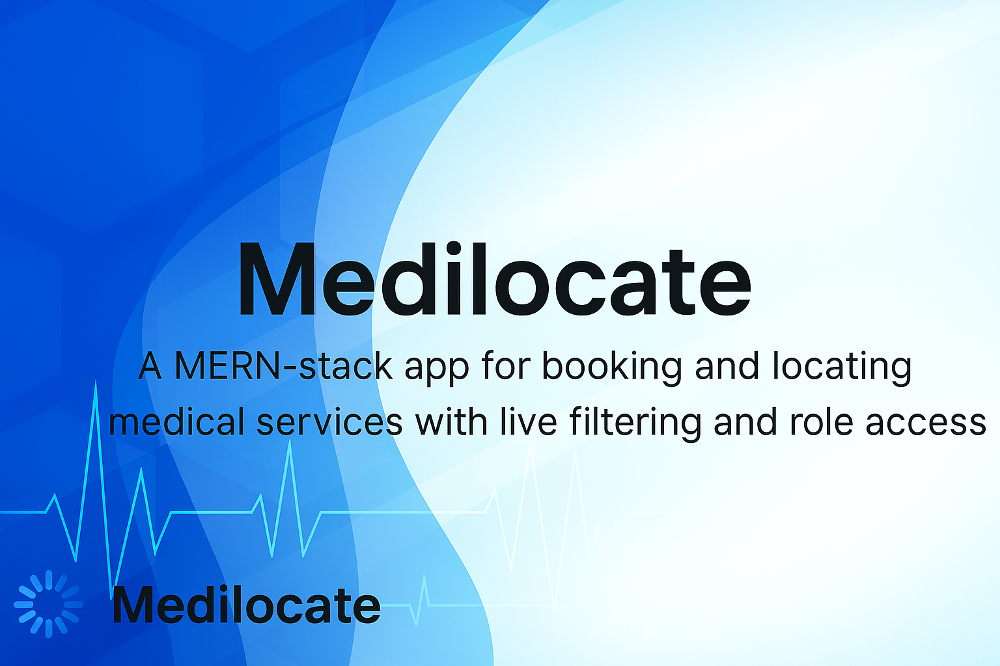

<h1 align="center">Medilocate</h1>

  

  <i>A MERN-stack app for booking and locating medical services with live filtering and role-based access.</i>

**ENSE 374 – Software Engineering Management**  
**MediLocate**  

**Team Members:**  
- **Ansar Ahmed** @ansarahmed789  
- **Gursharan Singh** 

---

## Table of Contents
1. [Introduction](#introduction)  
2. [Design Problem](#design-problem)  
   - [Problem Definition](#problem-definition)  
   - [Project Charter](#project-charter)  
3. [Solution](#solution)  
   - [Solution 1](#solution-1)  
   - [Solution 2](#solution-2)  
   - [Final Solution](#final-solution)  
4. [Team Work](#team-work)  
5. [Project Management](#project-management)  
6. [Conclusion and Future Work](#conclusion-and-future-work)  
7. [References](#references)  

---

## Introduction
Imagine a world where booking a medical appointment is as easy as ordering your favorite meal online—no more endless phone calls, no more waiting for days just to get a simple appointment. **MediLocate** brings this vision to life by developing a web-based application designed to revolutionize how Canadians book medical appointments.

Our platform supports two types of logins:
1. Patients for scheduling appointments.
2. Medical staff for managing schedules and clinic information.

**Key Features:**
- Browse clinics by location (Regina, Moose Jaw, and Saskatoon).
- Easy appointment booking with a simple interface.
- Dual login functionality for patients and medical staff.

---

## Design Problem

### Problem Definition
[View Business Case](https://github.com/ansarahmed789/ENSE-374-Project/blob/main/Business%20Case.pdf)

Accessing healthcare in Canada is challenging due to long wait times and difficulty securing appointments. This issue impacts patient outcomes and contributes to inefficiencies in healthcare management.

### Project Charter
[View Project Charter](https://github.com/ansarahmed789/ENSE-374-Project/blob/main/Project%20Charter.pdf)

---

## Solution

### Solution 1
Our initial idea focused on a flexible schedule management system for clinics. However, it lacked key features like automated reminders and EHR integration, which are essential for modern healthcare platforms.

### Solution 2
The second solution involved integrating Google Maps API for visualizing clinic locations. While innovative, it introduced complexities in real-time data management and accessibility features.

### Final Solution
Our final solution categorizes clinics by cities, making it easier for users to browse clinics in Regina, Moose Jaw, and Saskatoon. This approach prioritizes simplicity, accessibility, and scalability.  

---

## Team Work
- **[Meeting 1 Agenda](https://github.com/ansarahmed789/ENSE-374-Project/blob/main/Meeting%20Agenda/Meeting%201.docx)**  
- **[Meeting 2 Agenda](https://github.com/ansarahmed789/ENSE-374-Project/blob/main/Meeting%20Agenda/Meeting%202.docx)**  
- **[Project Status Reports](https://github.com/ansarahmed789/ENSE-374-Project/tree/main/Status%20Reports)**  

---

## Project Management
- **[Milestone-based Schedule](https://github.com/ansarahmed789/ENSE-374-Project/blob/main/Milestone-Based%20Schedule.pdf)**  
- **[Gantt Chart](https://github.com/ansarahmed789/ENSE-374-Project/blob/main/Status%20Reports/Gantt%20Chart.pdf)**  
- **[Lesson Learned Report](https://github.com/ansarahmed789/ENSE-374-Project/blob/main/Status%20Reports/Lesson%20Learned%20Report.md)**
- **[Learn more about our solutions](https://github.com/ansarahmed789/ENSE-374-Project/blob/main/Status%20Reports/Solution.pdf)**

---

## Conclusion and Future Work
Our project successfully delivered a streamlined platform for clinic management and appointment booking. While the solution met its primary goals, limitations such as geographic scope and real-time data updates remain.  
**Recommendations for Future Work:**
- Expand geographic coverage.  
- Add real-time data synchronization.  
- Incorporate accessibility features like text-to-speech.  

---

## References
All references follow the IEEE style.  
